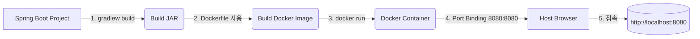

# Docker를 이용한 Spring Boot Backend 배포

## 목적
Spring Boot backend 프로젝트를 **Docker 환경에서 직접 실행**해보며,  
Dockerfile 작성 → 이미지 빌드 → 컨테이너 실행 과정을 이해하는 것

---

## 목표 절차

1. [Dockerfile 생성](#1-dockerfile-생성)
2. **(추후) Docker Compose 작성**
3. [이미지 빌드](#3-docker-이미지-빌드)
4. [컨테이너 실행 후 브라우저에서 확인](#4-컨테이너-실행)

---

## 전체 흐름



---

# 실제 절차

---

## 1. Dockerfile 생성

### 1-1. Dockerfile 내용

```docker
# 1. JDK 이미지
FROM eclipse-temurin:21-jdk

#2. Jar 파일 이름은 Gradle 기준 build/libs 안에 생성됨
ARG JAR_FILE=build/libs/*-SNAPSHOT.jar

#3. jar 복사
COPY ${JAR_FILE} app.jar

#4. Spring Boot 내부 포트
EXPOSE 8080

#5. 실행 명령
ENTRYPOINT ["java", "-jar", "/app.jar"]
```
### 1-2. Dockerfile 라인별 의미

```docker
# 1. JDK 이미지
## 도커의 Base 이미지로 Java 21이 포함된 환경을 사용한다.
## eclipse-temurin은 공식 오픈JDK 중 가장 안정적인 배포판.
FROM eclipse-temurin:21-jdk

# 2. 실행 가능한 JAR 파일 지정
## Docker 빌드시 build/libs 안의 *-SNAPSHOT.jar 파일을 변수로 사용.
## plain.jar 파일은 제외되어 정확한 실행 JAR만 포함됨.
ARG JAR_FILE=build/libs/*-SNAPSHOT.jar

# 3. 복사
## 로컬 JAR 파일 → Docker 이미지 내부 app.jar로 복사.
COPY ${JAR_FILE} app.jar

# 4. 내부 포트 지정
## Spring Boot 앱이 컨테이너 내부에서 사용하는 포트.
## 외부 연결은 -p 옵션으로 설정해야 함.
EXPOSE 8080

# 5. 실행 명령
## 컨테이너 시작 시 자동으로 Spring Boot 앱 실행.
ENTRYPOINT ["java", "-jar", "/app.jar"]
```

---

## 2. Jar 빌드
- .\gradlew clean build
- product-crud-full-0.0.1-SNAPSHOT.jar 생성

---

## 3. Docker 이미지 빌드
- docker build -t product-app .

---

## 4. 컨테이너 실행
- docker run -d -p 8080:8080 --name product-app product-app

---

## 요약 :

- JDK 21이 설치된 환경을 준비
- 빌드된 스프링 부트 JAR 가져오기
- 컨테이너 안에서 포트 8080으로 실행
- 컨테이너 시작 - 스프링 서버 실행

---

## 참고 :

- tree /f : 폴더 트리 구조